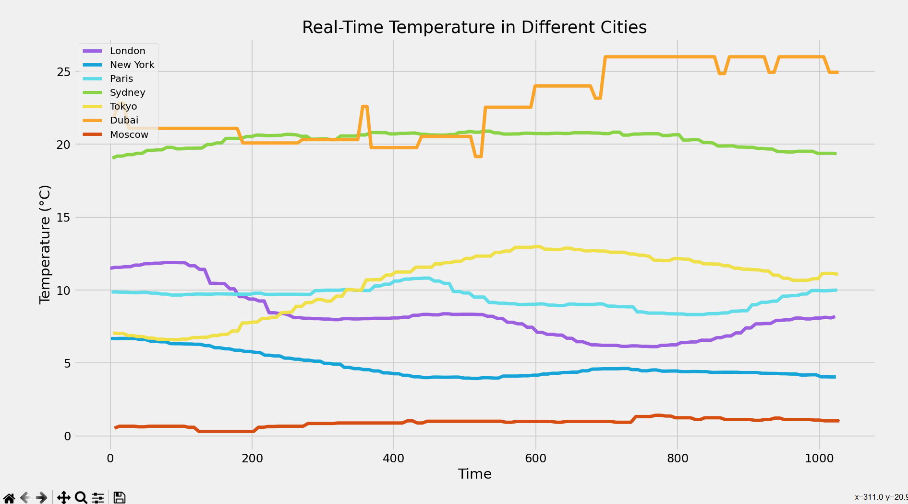
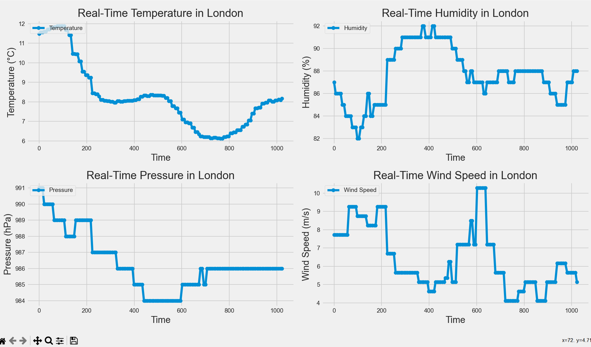

# Streaming Weather Data Visualization

This project implements a Flink streaming job that processes weather data using the OpenWeatherMap (OWM) API. The goal is to visualize and analyze changes in various weather variables across different cities worldwide.

## Overview

### OpenWeatherMap API
The OpenWeatherMap API serves as the source for weather data, providing real-time information and forecasts for various locations.

### Flink Streaming Job
The Flink streaming job reads data from the OpenWeatherMap API and applies a sliding window operation. The sliding window has a fixed size of 15 minutes and a slide interval of 5 minutes, allowing for real-time data processing.

## Visualization

Within each sliding window, the extracted weather data for selected variables (temperature, humidity, pressure, wind speed, and clouds) is plotted and visualized. This dynamic visualization helps showcase changes in weather conditions across different cities and the 5 minutes slide interval choice was made in order to ensure we have variability in the weather data for  meaningful plots.The sliding window choice helps showcase changes in weather conditions across different cities for a 15-minute period at a time.

## Key Features

- **Real-time Weather Data:** Utilizes the OpenWeatherMap API to fetch real-time weather data.
- **Sliding Window Operation:** Applies a sliding window operation for continuous analysis with a fixed size and slide interval.
- **Multi-Variable Analysis:** Visualizes changes in temperature, humidity, pressure, wind speed, and cloud coverage simultaneously.
- **City-wise Visualization:** Presents the data in a city-wise manner, allowing users to observe weather variations across different locations.

## Dependencies

- **jdk 11 or higher**
- **Flink 1.13 or higher**
- **scala 2.12 or higher**

## Usage

To use this project, follow these steps:

1. **Install the required dependencies above**
2. **Clone the repository into your preferred IDE**
3. **Run the openweathermap.scala script**
4. **Run the weather_data.ipynb script simultaneously to obtain the visualization plots in real-time**

## Visualization Output

We opted for two types of plots and we used matplotlib for data visualization.

The first plot type is a line-chart comparing the different weather variables for the different cities as shown below for the temperature variable as an example:

The second plot type is a combination of different linecharts illustrating the forecast for a particular city as shown below for London as an example: 

## Meet the Team

This Project is brought to you by our enthusiastic duo:

- [**Nour ElHouda Ben Ali**](https://www.linkedin.com/in/nour-elhouda-ben-ali-b01982195/)

- [**Eya Sahli**](https://www.linkedin.com/in/eya-sahli-5ab205174/)

## Contact

For inquiries or support, feel free to reach out to us:

- Nour ElHouda Ben Ali : [nour-el-houda.ben-ali@dauphine.eu](mailto:nour-el-houda.ben-ali@dauphine.eu)

- Eya Sahli: [eya.sahli@dauphine.eu](mailto:eya.sahli@dauphine.eu)

